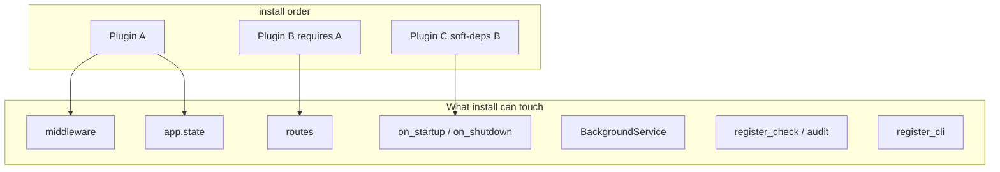

**Audience:** authors of `sova-*` crates and in-app plugins. App users start at [Plugins](/plugins/).

**Mental model:** a plugin is a typed unit that `install`s into [`App`](https://docs.rs/sova-core/latest/sova_core/struct.App.html) — usually middleware, shared state, routes, and optionally startup/shutdown, background services, CLI, and health checks.



### Two import surfaces

| Who | Import from |
|-----|-------------|
| App `main` | `sova::{App, …}` crate root |
| Plugin crate | `sova_core::extend::{…}` (+ root types like `App`, `Request`, `Plugin`) |

`extend` is the **plugin-author surface**: named middleware helpers, route introspection, HTML inject, logging hooks, SDK metadata. Prefer it over reaching into private modules.

### Typical install body

1. Read config (`config_doc` unset-fill and/or env)
2. Soft-install missing deps (`has_plugin` → `install`) or hard-declare `requires`
3. `app.state(…)` shared handles
4. `app.use_middleware(named(…))` / `with_leaked` / `with_state`
5. Optionally routes, `on_startup` / `on_shutdown`, `service`, `register_check`, `register_cli`

### Scaffold

```bash
cargo sovax generate plugin my-thing
```

### Where to go next

| Topic | Page |
|-------|------|
| `Plugin` / `id` / `meta` / SDK versions | [Plugin trait](/api/plugin-sdk/plugin-trait) |
| MW helpers | [Middleware](/api/plugin-sdk/middleware) |
| State, markers, soft deps | [State & dependencies](/api/plugin-sdk/state) |
| Toml / env | [Config](/api/plugin-sdk/config) |
| Startup, workers | [Lifecycle & services](/api/plugin-sdk/lifecycle) |
| Ready probes + CLI | [Checks & CLI](/api/plugin-sdk/checks-cli) |
| Routes + OpenAPI meta | [Routes & introspection](/api/plugin-sdk/routes) |
| Extractors, EventBus, Problem+ | [Extractors & Problem+](/api/plugin-sdk/extractors) |
| Typed events | [Events](/api/plugin-sdk/events) |
| HTML inject / log skip / DevTools hooks | [HTML & log hooks](/api/plugin-sdk/html-hooks) |
| Failures | [Errors](/api/plugin-sdk/errors) |
| Real recipes from in-tree plugins | [Recipes](/api/plugin-sdk/recipes) |
| Full `extend` table | [extend API](/api/plugin-sdk/extend-api) |
| Tests | [Testing](/api/plugin-sdk/testing) |
