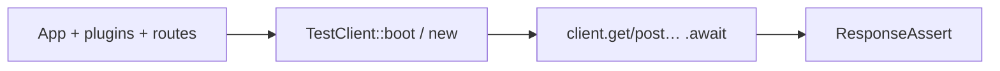

# Testing

In-process TestClient, ResponseAssert, TestApp/sqlite, cookies, auth hooks, real examples.

> Author guide — edit `docs/.vitepress/plugin-sdk-guides/testing.md`, then `pnpm docs:generate`.

**Audience:** plugin authors and app integration tests. End-user “how do I smoke-test my site?” is also covered — start here, then copy a pattern from in-tree `plugins/*/tests`.

You almost never need a real TCP port. Build an [`App`](https://docs.rs/sova-core/latest/sova_core/struct.App.html), compile it with [`TestClient`](https://docs.rs/sova-core/latest/sova_core/struct.TestClient.html), fire HTTP in-process, assert on the [`Response`](https://docs.rs/sova-core/latest/sova_core/struct.Response.html).



---

## Enable the APIs

Feature `testing` on `sova-core` (re-exported by facade `sova`):

```toml
# Plugin crate
[dev-dependencies]
sova-core = { version = "0.1", features = ["testing"] }
tokio = { version = "1", features = ["macros", "rt-multi-thread"] }

# App using the facade
[dev-dependencies]
sova = { version = "0.1", features = ["testing"] }
```

What you get:

| Type | Role |
|------|------|
| `TestClient` | In-process HTTP + cookie jar |
| `ClientRequest` | Builder: `.header` / `.json` / `.form` / `.body` → `.await` |
| `ResponseAssert` | `assert_status`, `json`, `json_value` |

Optional harness crate [`sova-testing`](https://docs.rs/sova-testing): sqlite tempfile, migrator, `TestApp`, JSON snapshots.

---

## Minimal plugin test

Mirror production install order: middleware the plugin expects, then `install`, then routes.

```rust
use sova_core::{App, Request, ResponseAssert, TestClient};

#[tokio::test]
async fn ping_ok() {
    let mut app = App::new();
    // app.use_middleware(sova_core::request_id()); // if your plugin needs X-Request-Id
    app.install(MyPlugin::new());
    app.get("/ping", |_req: Request| async { "pong" });

    let client = TestClient::new(app).unwrap();
    let res = client.get("/ping").await;
    res.assert_status(200);
    assert_eq!(
        String::from_utf8_lossy(res.body_bytes().expect("body")),
        "pong"
    );
}
```

Assert registration **before** `TestClient::new` (client consumes / builds the app):

```rust
let mut app = App::new();
app.install(MyPlugin::new());
assert!(app.has_plugin("my-plugin"));
```

---

## `new` vs `boot` / `tracked`

| Constructor | Startup hooks (`on_startup`, Db connect, …) |
|-------------|-----------------------------------------------|
| `TestClient::new(app)` | **Skipped** — fine for pure middleware / in-memory plugins |
| `TestClient::boot(app).await` | **Runs** — prefer for anything that touches DB / network in startup |
| `TestClient::tracked(app).await` | Alias of `boot` (Rocket-style name) |

```rust
use sova::TestClient; // facade re-export

#[tokio::test]
async fn home_ok() {
    let app = build_app().unwrap(); // same builder as main, or a test helper
    let c = TestClient::boot(app).await.unwrap();
    c.get("/").await.assert_status(200);
}
```

---

## Requests: JSON, form, headers, cookies

`ClientRequest` is awaitable. Cookies from `Set-Cookie` are stored and sent on later requests (session login flows).

```rust
let client = TestClient::new(app).unwrap();

// JSON POST
let created = client
    .post("/items")
    .header("Idempotency-Key", "k1")
    .json(&serde_json::json!({ "name": "a" }))
    .await;
created.assert_status(201);
let body: serde_json::Value = created.json();
assert_eq!(body["ok"], true);

// form
client
    .post("/login")
    .form(&[("email", "a@b.c"), ("password", "secret")])
    .await
    .assert_status(302);

// raw body
client
    .put("/raw")
    .header("content-type", "text/plain")
    .body("hello")
    .await
    .assert_status(200);

// Accept / custom headers
client
    .get("/protected")
    .header("accept", "application/json")
    .await
    .assert_status(401);
```

Read headers / body when assertions need more than status:

```rust
let res = client.get("/x").await;
res.assert_status(200);
assert_eq!(
    res.headers().get("x-idempotency-replay").and_then(|v| v.to_str().ok()),
    Some("false")
);
let raw = String::from_utf8_lossy(res.body_bytes().expect("buffered body"));
```

---

## Inject auth / state per request

`on_request` runs before dispatch (stackable). Useful when you do not want a full login round-trip:

```rust
let client = TestClient::boot(app).await.unwrap();
client.on_request(|req| {
    // e.g. set extension / pretend session — see sova_auth::testing::ActingAs
});
let res = client.get("/me").await;
res.assert_status(200);
client.clear_request_hooks();
```

In-tree helpers:

- `sova_auth::testing` — `acting_as`, user factories  
- `sova_notifications::testing` — `acting_as_id`

---

## DB plugins: `sova-testing::TestApp`

Temp sqlite file + migrator + `Db` install + `run_startup`, without racing on a shared `DATABASE_URL` across parallel tests.

```toml
[dev-dependencies]
sova-testing = { version = "0.1", features = ["sqlite"] } # match crate features in Cargo.toml
sova-core = { version = "0.1", features = ["testing"] }
```

```rust
use sova_core::{Request, Response, ResponseAssert, Router, TestClient};
use sova_testing::TestApp;

#[tokio::test]
async fn guarded_route() {
    let (_db, app) = TestApp::builder()
        .migrator::<MyMigrator>()
        .env("MY_SECRET", "test-secret-at-least-16")
        .install(MyPlugin::new())
        .configure(|app| {
            let mut r = Router::new();
            r.use_middleware(MyPlugin::guard());
            r.get("/ping", |_req: Request| async { Response::text("pong") });
            app.mount("/protected", r);
        })
        .build()
        .await;

    let c = TestClient::tracked(app).await.unwrap();
    c.get("/protected/ping")
        .header("accept", "application/json")
        .await
        .assert_status(401);
}
```

Keep `_db` alive for the whole test so the tempfile is not deleted early.

JSON snapshots (insta + common id/timestamp redactions):

```rust
use sova_testing::assert_json_snapshot;

let res = c.get("/api/items").await;
res.assert_status(200);
assert_json_snapshot!("items_list", res.json_value());
```

---

## Real in-tree patterns

| Goal | Look at |
|------|---------|
| Middleware + JSON + headers | `plugins/sova-idempotency/tests/replay.rs` |
| HTML inject / skip JSON | `plugins/sova-devtools/tests/inject_http.rs` |
| Jail FS + `req.ext()` | `plugins/sova-fs/tests/fs.rs` |
| Fortify guards + sqlite | `plugins/sova-auth/tests/guard.rs` |
| API tokens | `plugins/sova-passport/tests/api_tokens.rs` |

Copy the closest file; do not invent a second harness.

---

## Tracing in tests

Default `listen`/`run` installs a subscriber; unit tests often do not. If your plugin uses `add_log_event_hook` / DevTools-style sinks, install tracing once:

```rust
use sova_core::{ensure_tracing, LogConfig};

#[tokio::test]
async fn logs_visible() {
    LogConfig {
        filter: "my_plugin=debug,sova=info".into(),
        ..LogConfig::from_env()
    }
    .install();
    // or: ensure_tracing();
    // … build app, assert hooks saw events …
}
```

A filter of only `sova=info` will drop your crate’s `debug!` targets.

---

## Feature matrix & CI

Gate optional backends behind Cargo features the same way the facade does (`redis`, `sql`, …). In CI:

```bash
cargo test -p my-plugin
cargo test -p my-plugin --features redis
cargo test -p my-plugin --all-features
```

Keep rustdoc examples `ignore` (or feature-gated) when they need a runtime; this page holds the narrative copies.

---

## Checklist

1. `features = ["testing"]` on `sova-core` / `sova`  
2. Install plugins in production order  
3. Prefer `boot`/`tracked` if startup matters; `new` for pure in-memory  
4. Assert with `ResponseAssert`; use `body_bytes` / headers when needed  
5. DB → `TestApp` + keep `SqliteTestDb` in scope  
6. Steal an in-tree test instead of inventing glue  

See also: [HTML & log hooks](/api/plugin-sdk/html-hooks) · [Lifecycle](/api/plugin-sdk/lifecycle) · [Getting started → Testing](/guide/getting-started#testing)
